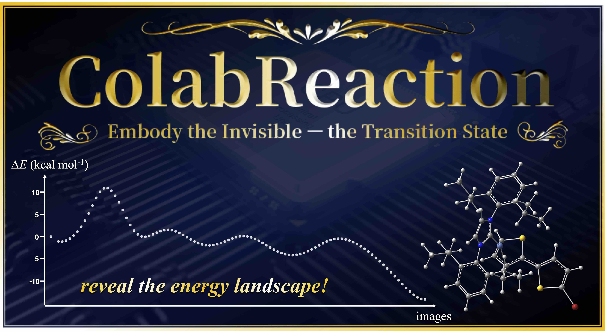

# ColabReaction: Accelerating Transition State Searches with Machine Learning Potentials on Google Colaboratory 

This repository contains a Google Colab notebook for transition state (TS) search using the Direct MaxFlux (DMF) method and ML potentials (UMA).

# 📘 Colab Notebook

[](https://ColabReaction.net)

<a href="https://ColabReaction.net" target="_blank">
  
</a>

# 📂 How to Use

1. Click the Colab link above
2. Upload your input files (e.g. `reactant.xyz`, `product.xyz`)
3. Follow the notebook cells

### 📘 User Guide (<a href="https://bilab.github.io/ColabReaction/User_Guide_EN.pdf">English</a>, <a href="https://bilab.github.io/ColabReaction/User_Guide_JP.pdf">日本語</a>)

# 🖥️ Installation (for local environment)

We recommend running this notebook on Google Colab.

If you wish to use it locally, you may try installing the required packages using:

```bash
pip install -r requirements.txt
```

Some packages may require additional manual installation (e.g., rdkit, dmf, fairchem-core, and custom Panel extensions).
Please refer to the respective project repositories for details.

⚠️ Note: We do not officially support or test local installations.

# 📖 Citation

If you use **ColabReaction** in your research, please cite the following publication:

1. Karasawa, M.; Leow, C. S.; Yajima, H.; Arai, S.; Nishizaki, H.; Terada, T.; Sato H. *ChemRxiv* **2025**. DOI: [10.26434/chemrxiv-2025-zvkqk](https://dx.doi.org/10.26434/chemrxiv-2025-zvkqk)

We also recommend citing the following references related to the underlying **DMF/UMA** methodology:

2. Nakano, M.; Karasawa, M.; Ohmura, T.; Terada, T.; Sato, H. *ChemRxiv* **2025**. DOI: [10.26434/chemrxiv-2025-md8k6-v2](https://dx.doi.org/10.26434/chemrxiv-2025-md8k6-v2)
3. Koda, S.; Saito, S. Locating Transition States by Variational Reaction Path Optimization with an Energy-Derivative-Free Objective Function. *J. Chem. Theory Comput.* **2024**, *20* (7), 2798-2811.
4. Koda, S.; Saito, S. Flat-Bottom Elastic Network Model for Generating Improved Plausible Reaction Paths. *J. Chem. Theory Comput* **2024**, *20* (16), 7176-7187.
5. Koda, S.; Saito, S. Correlated Flat-Bottom Elastic Network Model for Improved Bond Rearrangement in Reaction Paths. *J. Chem. Theory Comput.* **2025**, 21 (7), 3513-3522.
6. Wood, B. M.; Dzamba, M.; Fu, X.; Gao, M.; Shuaibi, M.; Barroso-Luque, L.; Abdelmaqsoud, K.; Gharakhanyan, V.; Kitchin, J. R.; Levine, D. S.; et al. UMA: A Family of Universal Models for Atoms. *arXiv preprint* **2025**, https://ai.meta.com/research/publications/uma-a-family-of-universal-models-for-atoms.
7. Levine, D. S.; Shuaibi, M.; Spotte-Smith, E. W. C.; Taylor, M. G.; Hasyim, M. R.; Michel, K.; Batatia, I.; Csányi, G.; Dzamba, M.; Eastman, P.; et al. The Open Molecules 2025 (OMol25) Dataset, Evaluations, and Models. *arXiv preprint* **2025**, arXiv:2505.08762. [physics.chem-ph]
8. fairchem; https://github.com/facebookresearch/fairchem

